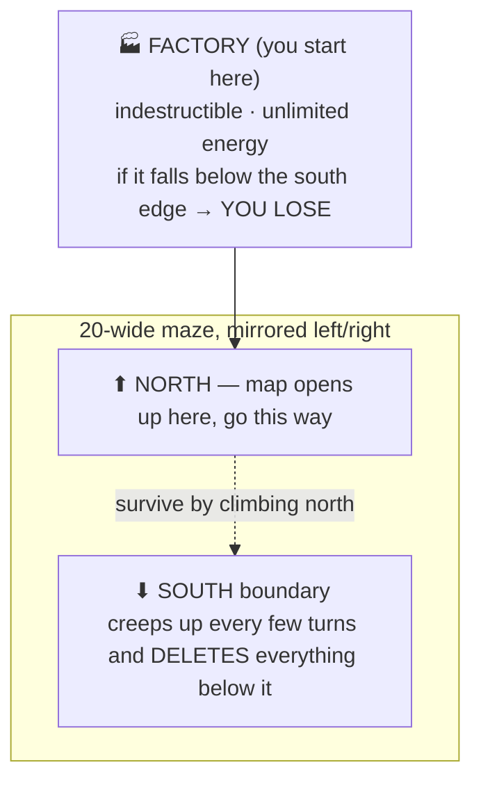
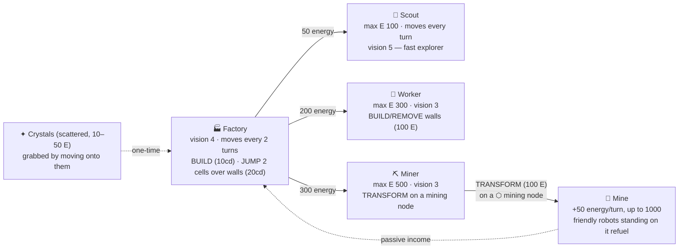
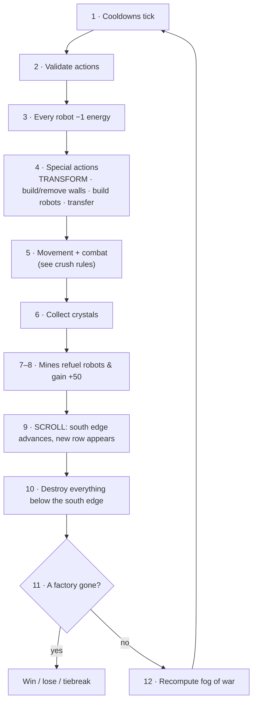
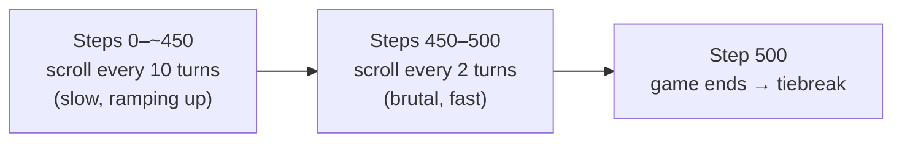
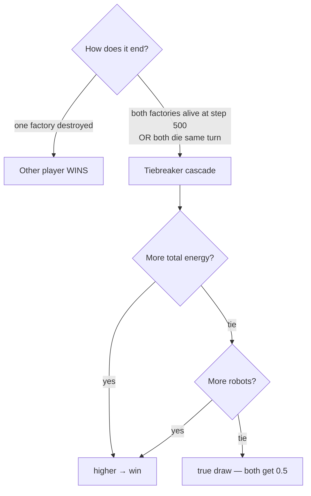

# Maze Crawler (`crawl`) — Game Guide

A 1v1 strategy game on a **20-wide, infinitely north-scrolling maze** with fog of
war. You start with one **Factory** near the bottom. The southern edge keeps
advancing north and **destroys everything it passes**. The last player with a
living factory wins. Max 501 steps.

> Full spec: `.venv/Lib/site-packages/kaggle_environments/envs/crawl/README.md`

## The big idea



The whole game is a race: **explore and grow faster than the scroll eats you**,
and don't let your factory get trapped behind walls.

## Robots & economy (the "tech tree")

Every robot burns **1 energy/turn**; at 0 energy it's forced idle. Energy comes
from **crystals** (one-time pickups) and **mines** (passive income you build).



| Robot | Cost | Max E | Moves | Vision | Special |
|-------|-----:|------:|:-----:|:------:|---------|
| 🏭 Factory | — | ∞ | every 2 turns | 4 | BUILD, JUMP (over walls), **indestructible** |
| 🔭 Scout | 50 | 100 | every turn | 5 | fast exploration |
| 🔧 Worker | 200 | 300 | every 2 turns | 3 | build / remove walls |
| ⛏ Miner | 300 | 500 | every 2 turns | 3 | turn into a mine on a node |

## A turn, start to finish



**Combat (crush rules)** when robots share a cell — *ownership doesn't matter,
friendly fire is real*: **Factory > Miner > Worker > Scout**; stronger crushes
weaker; **same type ⇒ all destroyed**. Factory is indestructible to non-factories.

## How the scroll speeds up



## Winning



**Reward** (what `main.py` prints): alive → your total robot energy; win by
tiebreak → `1`; loss → `0`; draw → `0.5`; eliminated → a negative number (the
earlier you die, the more negative).

## What your agent sees & does

```python
def agent(obs, config):
    obs["player"]   # 0 or 1 — which side you are
    obs["step"]     # current turn
    obs["robots"]   # {uid: [type, col, row, energy, owner, move_cd, jump_cd, build_cd]}
    obs["walls"]    # discovered maze layout (bitfield: N=1 E=2 S=4 W=8; -1 = unknown)
    obs["crystals"] # {"col,row": energy}   (only what's currently in view)
    obs["mines"]    # {"col,row": [energy, max, owner]}  (remembered once seen)
    obs["miningNodes"]  # {"col,row": 1}    (only currently in view)
    obs["southBound"], obs["northBound"]    # the deadly edge + the top
    # return: {uid: "ACTION"} e.g. "NORTH", "BUILD_SCOUT_NORTH", "JUMP_NORTH", "TRANSFORM", "IDLE"
```

Fog of war: you only see within your robots' combined vision. Walls and mines are
*remembered*; crystals, enemies, and mining nodes are **not** — they vanish from
your view once no robot can see them.

The current baseline in [agents/crawl-agent/main.py](agents/crawl-agent/main.py)
does the minimum to survive: head north, and have the factory `JUMP_NORTH` over
walls so it doesn't get scrolled off. Everything else (economy, mining, walls,
combat, pathfinding) is yours to build.
